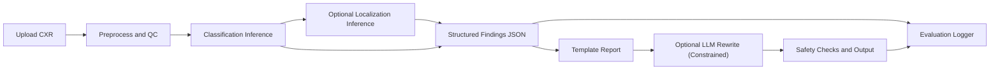

# RAV: Agentic AI for Radiology (Chest-First Plan)

Comprehensive execution plan for building an agentic radiology prototype, now optimized for chest X-ray delivery speed and feasibility.

Date: February 26, 2026

Current app version: `v0.2.4-agent-qa-chat`

Changelog: `CHANGELOG.md`

## 1) TL;DR

Primary direction:
- Build chest X-ray first.

Why:
- Faster time to a reliable MVP.
- Stronger off-the-shelf model ecosystem for chest radiology.
- Lower external blockers than brain MRI/CT pipelines.

Tumor note:
- Chest X-ray can cover tumor-adjacent findings (nodule/mass/lung tumor labels in specific datasets), but tumor characterization is still weaker than brain MRI tumor segmentation workflows.

## 2) Product Goal and Boundaries

Goal:
1. Accept a chest X-ray image.
2. Predict pathology findings with confidence.
3. Optionally localize findings (where supported).
4. Generate a short findings/impression report grounded in model outputs.

Boundaries:
- Research/education only.
- Not for clinical diagnosis or treatment decisions.
- No autonomous medical recommendations.

## 3) Why Chest First (and How Brain Compares)

Chest-first benefits:
1. 2D image pipelines are simpler than volumetric MRI/CT.
2. Faster training and iteration cycles.
3. Better availability of paired image-report datasets.
4. Better fit for current candidate model family (EVA-X, LLaVA-Rad, XrayGPT ecosystem).

Brain route tradeoff:
- Better tumor-specific depth, but higher coding lift and higher operational complexity.

## 4) Dataset Strategy

### Primary Chest Datasets

| Dataset | Role | Strengths | Risks/Blockers |
|---|---|---|---|
| CheXpert / CheXpert Plus | Core classification + report grounding | Large scale, common pathology labels, robust benchmark usage | Tumor-specific coverage is limited |
| MIMIC-CXR-JPG | Paired report workflows and robustness | Very large report-linked corpus | Access requires PhysioNet credentialing + DUA |
| VinDr-CXR | Localization and tumor-adjacent labels | Includes nodule/mass/lung tumor labels and localization support | Access friction via controlled access terms |

Current dataset execution status:
- [x] Using **CheXpert-v1.0-small** from Kaggle for active development:
  https://www.kaggle.com/datasets/ashery/chexpert
- [ ] Full/regular CheXpert training fit via GCP is planned and in progress (WIP).
- [ ] CheXpert Plus was originally explored but is currently deferred as operationally untenable for this course timeline (project planning estimate: ~3.5 TB footprint).

### Optional Comparison/Deferred Dataset Track

| Dataset | Route | Notes |
|---|---|---|
| BraTS 2021 | Brain MRI tumor | Keep as future high-complexity tumor track |
| UPENN-GBM | Brain MRI tumor | Useful for later external validation |

## 5) Labeling Plan (Chest)

Primary labels:
1. Multi-label thoracic findings from CheXpert-style taxonomy.
2. `No Finding` handling with explicit threshold logic.

Tumor-focused subset:
1. Nodule.
2. Mass.
3. Lung tumor (dataset-dependent availability).

Report target schema:
1. `findings[]` with confidence.
2. `critical_flags[]` (if any).
3. `impression` constrained to extracted findings.

Quality process:
1. Keep labels dataset-native first.
2. Add harmonization map across datasets.
3. Human spot-check high-disagreement slices of data.

## 6) Model Strategy

### Phase 1: Deterministic, Strong Baseline

1. Train/evaluate a chest multi-label classifier baseline.
2. Use calibrated probabilities and threshold tuning per class.
3. Output structured findings JSON.

### Phase 2: Localization Extension

1. Add detection/localization model where labels exist (VinDr-CXR path).
2. Join localization output with classification output.

### Phase 3: Report Generation

1. Start with template-based report generation from structured outputs.
2. Optional language model rewrite for readability only.
3. Hard constrain report content to model-supported findings.

### Candidate Foundation Models

Best fit for chest route:
1. EVA-X as chest-focused representation/modeling candidate.
2. LLaVA-Rad and XrayGPT for chest-radiology VLM experimentation.

Practical guidance:
- Do not start with expensive VLM fine-tuning.
- First lock reliable classification + calibration + grounded templates.

## 7) Agent Workflow



Core components:
1. Ingestion/preprocess.
2. Classifier.
3. Optional detector/localizer.
4. Structured findings layer.
5. Constrained reporting layer.
6. Evaluation and audit logging.

## 8) Evaluation Plan

Classification metrics:
1. AUROC (macro and per class).
2. F1, sensitivity, specificity.
3. Calibration (ECE, Brier score).

Localization metrics (if enabled):
1. mAP.
2. IoU-based overlap checks.

Reporting metrics:
1. Fact grounding score (report statements must match predicted findings).
2. Hallucination rate (unsupported statements).
3. Clinical coherence rubric (manual review sample).

Operational metrics:
1. End-to-end success rate.
2. Inference latency.
3. Failure mode breakdown.

## 9) Coding Lift: Chest vs Brain

| Workstream | Chest X-Ray Route | Brain MRI/CT Tumor Route | Relative Lift |
|---|---|---|---|
| Data ingestion | 2D image standardization | 3D volumetric, sequence handling | Brain higher |
| Training loops | Faster 2D iteration | Slower 3D training, higher VRAM | Brain much higher |
| Label engineering | Mostly multi-label classification | Segmentation and volumetric feature derivation | Brain higher |
| Report grounding | Straightforward from labels | More complex from 3D lesion features | Brain higher |
| Evaluation harness | Standard chest benchmarks | Segmentation + boundary + volumetrics | Brain higher |
| MVP integration | Moderate | Moderate-high | Brain higher |

Conclusion:
- Chest route is materially easier to execute quickly.
- Brain route remains the stronger future track for deep tumor-specific functionality.

## 10) Feasibility and External Blockers

| Dimension | Chest Route | Brain Route |
|---|---|---|
| Data availability | Strong | Strong but fragmented |
| Access blockers | Low-medium | Medium |
| Model fit today | Strong | Moderate unless using segmentation-first stack |
| Compute demand | Low-medium | High |
| Timeline risk | Low-medium | Medium-high |
| Overall feasibility for course MVP | High | Medium |

Expected chest blockers:
1. Dataset access approvals for some sources.
2. Label harmonization differences across datasets.
3. Grounded report generation quality control.

Mitigations:
1. Start with one fully available dataset first.
2. Freeze a canonical label map early.
3. Use constrained template reports before free-form generation.

## 11) 6-Week Chest-First Build Plan (Status Checklist)

Status date: 2026-02-27
Legend: checkboxes marked complete can be track-specific; explicit notes call out `POC` vs `CheXpert` status.

### Week 1: Scope Lock and Data Access

- [x] Confirm v1 dataset stack for active tracks (CheXpert + Kaggle POC).
- [x] Finalize label set and evaluation protocol in current configs.
- [ ] Complete access tasks for controlled datasets (MIMIC-CXR-JPG, VinDr-CXR); keep CheXpert Plus deferred unless storage plan changes.

Exit criteria:
- [x] Train/val/test split pipeline exists for each active track.

### Week 2: Baseline Classifier

- [x] Training pipeline for multi-label chest classification.
- [x] First benchmark run with per-class AUROC/F1 for Kaggle POC track.
- [ ] First benchmark run with per-class AUROC/F1 for primary CheXpert track.
- [ ] Initial calibration curves documented.

Exit criteria:
- [ ] Reproducible baseline metrics artifacts saved under `outputs/.../metrics/` for both tracks.

### Week 3: Structured Findings Layer

- [x] Findings JSON schema and output payload implemented.
- [x] Threshold policy and confidence buckets implemented.
- [x] Batch/single inference scripts available.

Exit criteria:
- [x] Stable machine-readable outputs for evaluation set.

### Week 4: Report Generation Layer

- [x] Template-based findings + impression generation.
- [x] Constrained rewrite option (optional) wired to an external LLM (OpenAI wrapper + Streamlit toggle).
- [x] Grounding guardrails (output constrained to predicted findings).

Exit criteria:
- [x] End-to-end output includes grounded narrative text.

### Week 5: Localization Extension and Error Analysis

- [ ] Optional localization model for nodule/mass path.
- [ ] Error taxonomy dashboard.
- [ ] Calibration and threshold retuning pass.

Exit criteria:
- [ ] Improved performance on key classes with documented tradeoffs.

### Week 6: UI and Comparison Report

- [x] Working UI/API flow (inference + metrics pages) validated on POC.
- [ ] Working UI/API flow validated with trained CheXpert checkpoint + metrics.
- [ ] Final metrics + failure analysis report finalized.
- [x] Chest vs brain feasibility/coding-lift comparison documented.

Exit criteria:
- [ ] Stable, final presentation artifact package (metrics report + demo script).

## 12) Proposed Repo Layout

```text
RAV/
  README.md
  PDF/
  data/
    raw/
    processed/
  src/
    ingest/
    preprocess/
    models/
      chest/
      brain_deferred/
    inference/
    reporting/
    evaluation/
    agent/
  configs/
  notebooks/
  scripts/
  outputs/
    checkpoints/
    metrics/
    reports/
```

## 13) Definition of Done (Chest MVP)

MVP is done when:
- [ ] Chest classifier meets target baseline metrics on held-out data for the primary CheXpert track.
- [x] Structured findings JSON is stable and schema-validated.
- [x] Generated report text is grounded and low-hallucination by construction.
- [x] End-to-end app path is reliable: upload -> inference -> results.
- [x] Comparison section documents why brain was deferred.

## 14) While Training: Productive Checklist

If a training run is active, do these in parallel:
- [x] Keep Streamlit environment consistency (`.venv` + `python -m streamlit`).
- [x] Use ETA monitor from `outputs/.../metrics/history.jsonl`.
- [x] Prepare test-time evaluation command for `checkpoints/best.pt`.
- [x] Run data sanity checks (class balance, missing files, split leakage).
- [x] Draft next experiment configs (`image_size`, `batch_size`, `lr`, `backbone`).
- [x] Keep one-command reproducible wrappers (for example, `make train-poc`).

Useful commands:
1. `python scripts/monitor_training_eta.py --config configs/poc/chest_pneumonia_binary.yaml --watch`
2. `python scripts/check_chest_data_sanity.py --config configs/poc/chest_pneumonia_binary.yaml`
3. `make eta-poc-watch`
4. `make sanity-poc`

## 15) MVP Minimum Required (Execution Checklist)

Current status for class-project MVP (POC track):
- [x] One trained checkpoint exists at `outputs/.../checkpoints/best.pt`.
- [x] Held-out evaluation is saved under `outputs/.../metrics/` with AUROC/F1.
- [x] Single-image inference works via `scripts/infer_chest_single.py`.
- [x] Streamlit demo runs from the same `.venv` as training and loads `best.pt`.
- [x] Findings/report output is grounded only in predicted findings.
- [x] README + runbook include exact reproduce steps and known caveats.

Current status for primary track (CheXpert):
- [ ] One trained checkpoint exists at `outputs/chest_baseline/checkpoints/best.pt` from a completed primary run.
- [ ] Held-out primary evaluation exists under `outputs/chest_baseline/metrics/` with AUROC/F1.
- [ ] Streamlit model-metrics page verified end-to-end with primary artifacts.

Track equivalence note (POC vs CheXpert):
- [x] Same training/eval/inference code path is used for both tracks.
- [x] Same image preprocessing stack is used (`PIL` load -> `RGB` -> resize/normalize tensor transform).
- [x] Main practical differences are scale and labels: CheXpert is much larger and multi-label (14 findings), while Kaggle POC is smaller and binary (`Pneumonia`/`No Finding`).

## 16) Next 72 Hours

- [ ] Finalize primary-data path: full/regular CheXpert on GCP (WIP), with CheXpert-v1.0-small as local default.
- [ ] Create canonical label map for selected datasets.
- [x] Stand up baseline training/eval pipeline.
- [x] Implement findings JSON schema and template report generator.

## 16A) Slide Commitments Status (From Proposal)

- [x] Output key diagnostic findings in natural language.
- [ ] Output subtype-level claims (for example `compound/simple fracture`, `malignant/benign tumor`) with validated supervision.
- [ ] Integrate Gemini 1.5 Flash for natural-language input/output (and define tuning plan).
- [ ] Evaluate MCP integration via MedAgentBench.
- [ ] Quantitative evaluation against pathology labels with F1-based reporting for all target tracks (POC complete; CheXpert pending full run).
- [ ] Qualitative evaluation by a stronger medical LLM (for example MedGemma) with semantic-similarity scoring.

## 17) Reference Links

- Initial proposal PDF: `PDF/EECS E6895 - Initial Proposal - Radiologist - RAV.pdf`
- Archive plan PDF: `PDF/EECS E6895 - Project Plan - Radiologist - RAV - Archive.pdf`
- CheXpert: https://aimi.stanford.edu/datasets/chexpert-chest-x-rays
- CheXpert Plus (deferred in current scope): https://aimi.stanford.edu/datasets/chexpert-plus
- MIMIC-CXR-JPG: https://physionet.org/content/mimic-cxr-jpg/
- VinDr-CXR: https://physionet.org/content/vindr-cxr/
- EVA-X: https://github.com/hustvl/EVA-X
- LLaVA-Rad: https://github.com/microsoft/LLaVA-Rad
- XrayGPT: https://github.com/mbzuai-oryx/XrayGPT
- BraTS 2021 (deferred comparison): https://www.cancerimagingarchive.net/analysis-result/rsna-asnr-miccai-brats-2021/
- UPENN-GBM (deferred comparison): https://www.cancerimagingarchive.net/collection/upenn-gbm/

## 18) Implementation Artifacts (Now Included)

Core files:
1. `requirements.txt`
2. `configs/primary/chest_chexpert.yaml` (primary)
3. `configs/primary/chest_localization_extension.yaml` (primary extension)
4. `configs/poc/chest_pneumonia_binary.yaml` (POC)
5. `scripts/prepare_chexpert_data.py` (primary prep)
6. `scripts/poc/prepare_chest_pneumonia_data.py` (POC prep)
7. `scripts/train_chest_baseline.py`
8. `scripts/eval_chest_baseline.py`
9. `scripts/infer_chest_single.py`
10. `src/rav_chest/` package
11. `app/streamlit_app.py`
12. `docs/CHEST_RUNBOOK.md`
13. `docs/HARDWARE_SIZING.md`
14. `scripts/monitor_training_eta.py`
15. `scripts/check_chest_data_sanity.py`
16. `Makefile`
17. `src/rav_chest/llm.py` + `scripts/llm_wrapper.py` (OpenAI API wrapper)
18. `gcp/` + `scripts/gcp_*.sh` (GCP spot-runner adapter)

Track-specific requirements:
1. Shared (both tracks):
   - Python env from `.venv` and `pip install -r requirements.txt`
   - Run Streamlit via `python -m streamlit run app/streamlit_app.py`
2. Primary (CheXpert):
   - Local default dataset under `data/raw/chexpert/CheXpert-v1.0-small/` (Kaggle mirror) with `train.csv`, `valid.csv`, and image folders
   - Full/regular CheXpert training path is planned on GCP (WIP)
   - Prepared CSVs at `data/processed/chexpert_{train,val,test}.csv` from `scripts/prepare_chexpert_data.py`
3. POC (Kaggle chest-xray-pneumonia):
   - Raw split folders under `data/poc/chest_xray_pneumonia/raw/{train,val,test}` (or source zips in `data/poc/chest_xray_pneumonia/source_archives/`)
   - Prepared CSVs at `data/poc/chest_xray_pneumonia/processed/chest_pneumonia_{train,val,test}.csv` from `scripts/poc/prepare_chest_pneumonia_data.py`
4. Current model backbone in both provided configs:
   - `densenet121` (`configs/primary/chest_chexpert.yaml`, `configs/poc/chest_pneumonia_binary.yaml`)
   - Also supported by code: `resnet50`, `efficientnet_b0` (`src/rav_chest/models.py`)
5. Git sharing note:
   - `outputs/`, `data/raw/`, `data/processed/`, and `data/poc/` are ignored by git (`.gitignore`)
   - Teammates cloning the repo still need dataset access and either local training or a separately shared checkpoint (`best.pt`)

Primary quickstart (CheXpert):
```bash
cd /Users/wax/Documents/Programming/RAV
python3 -m venv .venv                     # only the first time, to set up the virtual env
source .venv/bin/activate
pip install -r requirements.txt
python scripts/prepare_chexpert_data.py \
  --chexpert-root data/raw/chexpert/CheXpert-v1.0-small \
  --output-dir data/processed
python scripts/train_chest_baseline.py --config configs/primary/chest_chexpert.yaml
python scripts/eval_chest_baseline.py --config configs/primary/chest_chexpert.yaml --split test
python -m streamlit run app/streamlit_app.py
```

Resume training from latest epoch checkpoint:
```bash
python scripts/train_chest_baseline.py \
  --config configs/primary/chest_chexpert.yaml \
  --resume-checkpoint outputs/chest_baseline/checkpoints/last.pt
```

POC quickstart (Kaggle):
```bash
python scripts/poc/prepare_chest_pneumonia_data.py \
  --data-root data/poc/chest_xray_pneumonia/raw \
  --output-dir data/poc/chest_xray_pneumonia/processed
python scripts/train_chest_baseline.py --config configs/poc/chest_pneumonia_binary.yaml
python scripts/eval_chest_baseline.py --config configs/poc/chest_pneumonia_binary.yaml --split test
python -m streamlit run app/streamlit_app.py
```

Resume POC training:
```bash
python scripts/train_chest_baseline.py \
  --config configs/poc/chest_pneumonia_binary.yaml \
  --resume-checkpoint outputs/poc/chest_pneumonia_binary/checkpoints/last.pt
```

If `streamlit` resolves to Conda (`/opt/anaconda3/bin/streamlit`) while training uses `.venv`,
use `python -m streamlit ...` to avoid Torch linker mismatches.

Convenience make targets:
```bash
# use PYTHON=.venv/bin/python if your shell is not already in .venv
make train-poc
make eval-poc
make sanity-poc
make eta-poc-watch
make streamlit
```

Simple LLM wrapper (OpenAI API):
```bash
# one-time: cp .env.example .env and set your real key in .env

# direct prompt
python scripts/llm_wrapper.py \
  --prompt "Summarize the likely chest findings in one sentence."

# rewrite an existing report payload JSON from model output
python scripts/llm_wrapper.py \
  --report-json outputs/poc/chest_pneumonia_binary/reports/sample.json \
  --output outputs/poc/chest_pneumonia_binary/reports/sample_rewrite.txt
```

Streamlit LLM rewrite (optional):
1. Ensure `.env` has `OPENAI_API_KEY` (auto-loaded by the app/wrapper).
2. In Streamlit Inference page, enable `Rewrite impression with OpenAI`.
3. Optionally change `LLM Model (Rewrite/Q&A)` (default: `gpt-4.1-mini`).
4. Run inference; deterministic and rewritten impressions are shown side-by-side.
5. Downloaded report JSON includes `llm_rewrite` metadata (`enabled`, `model`, `rewritten_impression`, `error`).

Streamlit Ask Agent Q&A (optional):
1. Run at least one inference in the current session (or upload a report JSON in the Ask Agent page).
2. Open sidebar page `Ask Agent`.
3. Ask natural-language questions (for example: "Why was Pneumonia marked positive?").
4. Answers are grounded in the report context (`findings`, `impression`, `probabilities`) and should not add unsupported findings.

GCP spot-runner adapter (optional):

Detailed guide: `gcp/GETTING_STARTED.md`
Operational notes/troubleshooting: `gcp/GCP_NOTES.md`

```bash
# 1) one-time setup
cp gcp/rav_spot.env.example gcp/rav_spot.env
# edit gcp/rav_spot.env: PROJECT/REGION/SA/BUCKET/IMAGE/RUNNER_DIR
# optional: SYNC_INTERVAL_SEC controls periodic checkpoint sync cadence
# optional: GPU_TIMEOUT_SEC controls GPU-driver wait before startup fails (default 600)
# optional: set PROGRESS_STALL_POLLS so (POLL_INTERVAL * PROGRESS_STALL_POLLS) >= GPU_TIMEOUT_SEC

# 2) build and push training image
bash scripts/gcp_build_image.sh

# 3) submit spot jobs
bash scripts/gcp_submit_primary.sh
bash scripts/gcp_submit_poc.sh

# resume a previous run by reusing the same run id
bash scripts/gcp_submit_primary.sh --run-id rav-chexpert-001
bash scripts/gcp_submit_poc.sh --run-id rav-poc-001

# 4) check status/events
bash scripts/gcp_ops.sh status
bash scripts/gcp_ops.sh events --since 24h
```

Notes:
1. Yes, Docker is required for this path (image build + VM container launch).
2. Wrappers default to `--skip-build` on spot submit, so build image first with `gcp_build_image.sh`.
3. Submit wrappers run `scripts/gcp_train_with_checkpoint_sync.sh` for both primary and POC tracks.
4. During training, wrapper syncs `checkpoints/last.pt`, `checkpoints/best.pt`, and metrics to GCS every `SYNC_INTERVAL_SEC`.
5. On restart with the same `RUN_ID`, wrapper auto-downloads `last.pt` and resumes via `--resume-checkpoint`.
6. Wrapper copies `outputs/...` into `/app/results/...` at run end for runner artifact upload.
