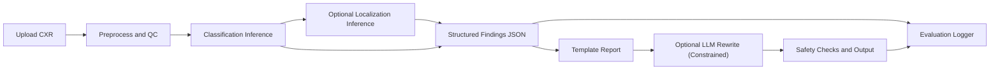

# RAV: Agentic AI for Radiology (Chest-First Plan)

Comprehensive execution plan for building an agentic radiology prototype, now optimized for chest X-ray delivery speed and feasibility.

Date: February 26, 2026

## 1) TL;DR

Primary direction:
- Build chest X-ray first.

Why:
- Faster time to a reliable MVP.
- Stronger off-the-shelf model ecosystem for chest radiology.
- Lower external blockers than brain MRI/CT pipelines.

Tumor note:
- Chest X-ray can cover tumor-adjacent findings (nodule/mass/lung tumor labels in specific datasets), but tumor characterization is still weaker than brain MRI tumor segmentation workflows.

## 2) Product Goal and Boundaries

Goal:
1. Accept a chest X-ray image.
2. Predict pathology findings with confidence.
3. Optionally localize findings (where supported).
4. Generate a short findings/impression report grounded in model outputs.

Boundaries:
- Research/education only.
- Not for clinical diagnosis or treatment decisions.
- No autonomous medical recommendations.

## 3) Why Chest First (and How Brain Compares)

Chest-first benefits:
1. 2D image pipelines are simpler than volumetric MRI/CT.
2. Faster training and iteration cycles.
3. Better availability of paired image-report datasets.
4. Better fit for current candidate model family (EVA-X, LLaVA-Rad, XrayGPT ecosystem).

Brain route tradeoff:
- Better tumor-specific depth, but higher coding lift and higher operational complexity.

## 4) Dataset Strategy

### Primary Chest Datasets

| Dataset | Role | Strengths | Risks/Blockers |
|---|---|---|---|
| CheXpert / CheXpert Plus | Core classification + report grounding | Large scale, common pathology labels, robust benchmark usage | Tumor-specific coverage is limited |
| MIMIC-CXR-JPG | Paired report workflows and robustness | Very large report-linked corpus | Access requires PhysioNet credentialing + DUA |
| VinDr-CXR | Localization and tumor-adjacent labels | Includes nodule/mass/lung tumor labels and localization support | Access friction via controlled access terms |

### Optional Comparison/Deferred Dataset Track

| Dataset | Route | Notes |
|---|---|---|
| BraTS 2021 | Brain MRI tumor | Keep as future high-complexity tumor track |
| UPENN-GBM | Brain MRI tumor | Useful for later external validation |

## 5) Labeling Plan (Chest)

Primary labels:
1. Multi-label thoracic findings from CheXpert-style taxonomy.
2. `No Finding` handling with explicit threshold logic.

Tumor-focused subset:
1. Nodule.
2. Mass.
3. Lung tumor (dataset-dependent availability).

Report target schema:
1. `findings[]` with confidence.
2. `critical_flags[]` (if any).
3. `impression` constrained to extracted findings.

Quality process:
1. Keep labels dataset-native first.
2. Add harmonization map across datasets.
3. Human spot-check high-disagreement slices of data.

## 6) Model Strategy

### Phase 1: Deterministic, Strong Baseline

1. Train/evaluate a chest multi-label classifier baseline.
2. Use calibrated probabilities and threshold tuning per class.
3. Output structured findings JSON.

### Phase 2: Localization Extension

1. Add detection/localization model where labels exist (VinDr-CXR path).
2. Join localization output with classification output.

### Phase 3: Report Generation

1. Start with template-based report generation from structured outputs.
2. Optional language model rewrite for readability only.
3. Hard constrain report content to model-supported findings.

### Candidate Foundation Models

Best fit for chest route:
1. EVA-X as chest-focused representation/modeling candidate.
2. LLaVA-Rad and XrayGPT for chest-radiology VLM experimentation.

Practical guidance:
- Do not start with expensive VLM fine-tuning.
- First lock reliable classification + calibration + grounded templates.

## 7) Agent Workflow



Core components:
1. Ingestion/preprocess.
2. Classifier.
3. Optional detector/localizer.
4. Structured findings layer.
5. Constrained reporting layer.
6. Evaluation and audit logging.

## 8) Evaluation Plan

Classification metrics:
1. AUROC (macro and per class).
2. F1, sensitivity, specificity.
3. Calibration (ECE, Brier score).

Localization metrics (if enabled):
1. mAP.
2. IoU-based overlap checks.

Reporting metrics:
1. Fact grounding score (report statements must match predicted findings).
2. Hallucination rate (unsupported statements).
3. Clinical coherence rubric (manual review sample).

Operational metrics:
1. End-to-end success rate.
2. Inference latency.
3. Failure mode breakdown.

## 9) Coding Lift: Chest vs Brain

| Workstream | Chest X-Ray Route | Brain MRI/CT Tumor Route | Relative Lift |
|---|---|---|---|
| Data ingestion | 2D image standardization | 3D volumetric, sequence handling | Brain higher |
| Training loops | Faster 2D iteration | Slower 3D training, higher VRAM | Brain much higher |
| Label engineering | Mostly multi-label classification | Segmentation and volumetric feature derivation | Brain higher |
| Report grounding | Straightforward from labels | More complex from 3D lesion features | Brain higher |
| Evaluation harness | Standard chest benchmarks | Segmentation + boundary + volumetrics | Brain higher |
| MVP integration | Moderate | Moderate-high | Brain higher |

Conclusion:
- Chest route is materially easier to execute quickly.
- Brain route remains the stronger future track for deep tumor-specific functionality.

## 10) Feasibility and External Blockers

| Dimension | Chest Route | Brain Route |
|---|---|---|
| Data availability | Strong | Strong but fragmented |
| Access blockers | Low-medium | Medium |
| Model fit today | Strong | Moderate unless using segmentation-first stack |
| Compute demand | Low-medium | High |
| Timeline risk | Low-medium | Medium-high |
| Overall feasibility for course MVP | High | Medium |

Expected chest blockers:
1. Dataset access approvals for some sources.
2. Label harmonization differences across datasets.
3. Grounded report generation quality control.

Mitigations:
1. Start with one fully available dataset first.
2. Freeze a canonical label map early.
3. Use constrained template reports before free-form generation.

## 11) 6-Week Chest-First Build Plan

### Week 1: Scope Lock and Data Access

Deliverables:
1. Confirm v1 dataset stack.
2. Finalize label set and evaluation protocol.
3. Complete access tasks for controlled datasets.

Exit criteria:
- One complete train/val/test split prepared.

### Week 2: Baseline Classifier

Deliverables:
1. Training pipeline for multi-label chest classification.
2. First benchmark run with per-class AUROC/F1.
3. Initial calibration curves.

Exit criteria:
- Reproducible baseline metrics.

### Week 3: Structured Findings Layer

Deliverables:
1. Findings JSON schema implemented.
2. Threshold policy and confidence buckets.
3. Batch inference script.

Exit criteria:
- Stable machine-readable outputs for evaluation set.

### Week 4: Report Generation Layer

Deliverables:
1. Template-based findings + impression generation.
2. Constrained rewrite option (optional).
3. Hallucination guardrails and refusal behavior.

Exit criteria:
- End-to-end output includes grounded narrative text.

### Week 5: Localization Extension and Error Analysis

Deliverables:
1. Optional localization model for nodule/mass path.
2. Error taxonomy dashboard.
3. Calibration and threshold retuning.

Exit criteria:
- Improved performance on key classes with documented tradeoffs.

### Week 6: Demo and Comparison Report

Deliverables:
1. Demo UI/API flow.
2. Final metrics + failure analysis report.
3. Chest vs brain feasibility/coding-lift comparison write-up.

Exit criteria:
- Stable demo and reproducible evaluation artifacts.

## 12) Proposed Repo Layout

```text
RAV/
  README.md
  PDF/
  data/
    raw/
    processed/
  src/
    ingest/
    preprocess/
    models/
      chest/
      brain_deferred/
    inference/
    reporting/
    evaluation/
    agent/
  configs/
  notebooks/
  scripts/
  outputs/
    checkpoints/
    metrics/
    reports/
```

## 13) Definition of Done (Chest MVP)

MVP is done when:
1. Chest classifier meets target baseline metrics on held-out data.
2. Structured findings JSON is stable and schema-validated.
3. Generated report text is grounded and low-hallucination.
4. End-to-end app path is reliable: upload -> inference -> results.
5. Comparison section documents why brain was deferred.

## 14) Next 72 Hours

1. Finalize v1 stack: CheXpert Plus first, then MIMIC-CXR-JPG or VinDr-CXR.
2. Create canonical label map for selected datasets.
3. Stand up baseline training/eval pipeline.
4. Implement findings JSON schema and template report generator.

## 15) Reference Links

- Initial proposal PDF: `PDF/EECS E6895 - Initial Proposal - Radiologist - RAV.pdf`
- Archive plan PDF: `PDF/EECS E6895 - Project Plan - Radiologist - RAV - Archive.pdf`
- CheXpert: https://aimi.stanford.edu/datasets/chexpert-chest-x-rays
- CheXpert Plus: https://aimi.stanford.edu/datasets/chexpert-plus
- MIMIC-CXR-JPG: https://physionet.org/content/mimic-cxr-jpg/
- VinDr-CXR: https://physionet.org/content/vindr-cxr/
- EVA-X: https://github.com/hustvl/EVA-X
- LLaVA-Rad: https://github.com/microsoft/LLaVA-Rad
- XrayGPT: https://github.com/mbzuai-oryx/XrayGPT
- BraTS 2021 (deferred comparison): https://www.cancerimagingarchive.net/analysis-result/rsna-asnr-miccai-brats-2021/
- UPENN-GBM (deferred comparison): https://www.cancerimagingarchive.net/collection/upenn-gbm/

## 16) Implementation Artifacts (Now Included)

Core files:
1. `requirements.txt`
2. `configs/primary/chest_chexpert.yaml` (primary)
3. `configs/primary/chest_localization_extension.yaml` (primary extension)
4. `configs/poc/chest_pneumonia_binary.yaml` (POC)
5. `scripts/prepare_chexpert_data.py` (primary prep)
6. `scripts/poc/prepare_chest_pneumonia_data.py` (POC prep)
7. `scripts/train_chest_baseline.py`
8. `scripts/eval_chest_baseline.py`
9. `scripts/infer_chest_single.py`
10. `src/rav_chest/` package
11. `docs/CHEST_RUNBOOK.md`
12. `docs/HARDWARE_SIZING.md`

Primary quickstart (CheXpert):
```bash
cd /Users/wax/Documents/Programming/RAV
python3 -m venv .venv
source .venv/bin/activate
pip install -r requirements.txt
python scripts/prepare_chexpert_data.py \
  --chexpert-root data/raw/chexpert/CheXpert-v1.0 \
  --output-dir data/processed
python scripts/train_chest_baseline.py --config configs/primary/chest_chexpert.yaml
python scripts/eval_chest_baseline.py --config configs/primary/chest_chexpert.yaml --split test
```

POC quickstart (Kaggle):
```bash
python scripts/poc/prepare_chest_pneumonia_data.py \
  --data-root data/poc/chest_xray_pneumonia/raw \
  --output-dir data/poc/chest_xray_pneumonia/processed
python scripts/train_chest_baseline.py --config configs/poc/chest_pneumonia_binary.yaml
python scripts/eval_chest_baseline.py --config configs/poc/chest_pneumonia_binary.yaml --split test
```
